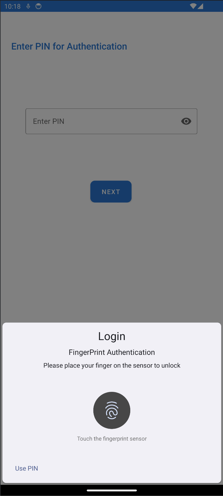
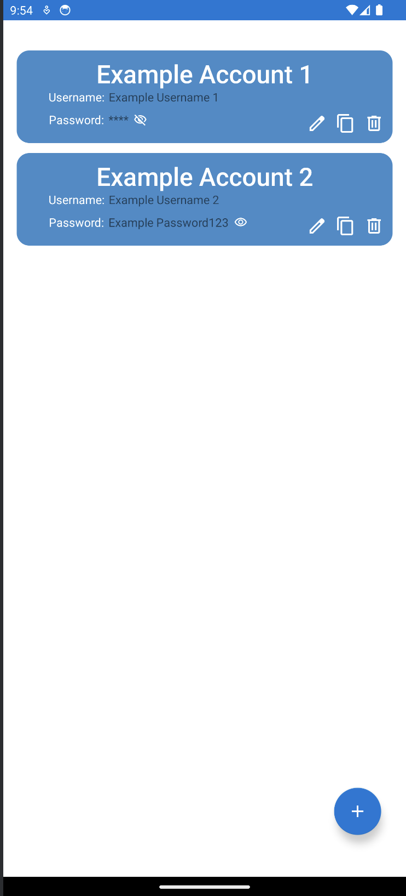

# Password Manager App
### This is an android password manager app I created to securily and easily store my passwords on my phone

## Built With
- Android Studio
- Java

## Features
- Option for bio-metric authentication
- Data encrypted with AES encryption
- Googles material design components for Android
- Add, copy, delete and edit passwords easily

## Installation
- Download Android Studio https://developer.android.com/studio
- Open project in Android Studio
- Run Application
### Or
- Load provided .apk (PasswordManager.apk) onto an android phone and run (supports android 9+)

## Screenshots

| Set Pin                                                         | Bio-Metric Authentication                                                 | Add Account                                                             |
|-----------------------------------------------------------------|---------------------------------------------------------------------------|-------------------------------------------------------------------------|
|  |  |  |

| Vault                                                        | Edit Account                                                              |
|--------------------------------------------------------------|---------------------------------------------------------------------------|
|  |  |

## Contact
Kirill Toptun - kirilltoptun@gmail.com